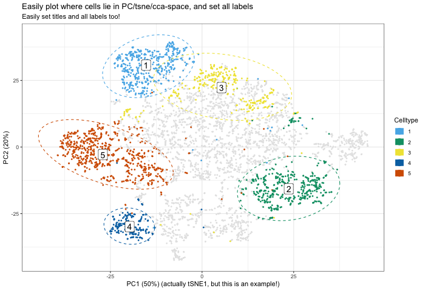
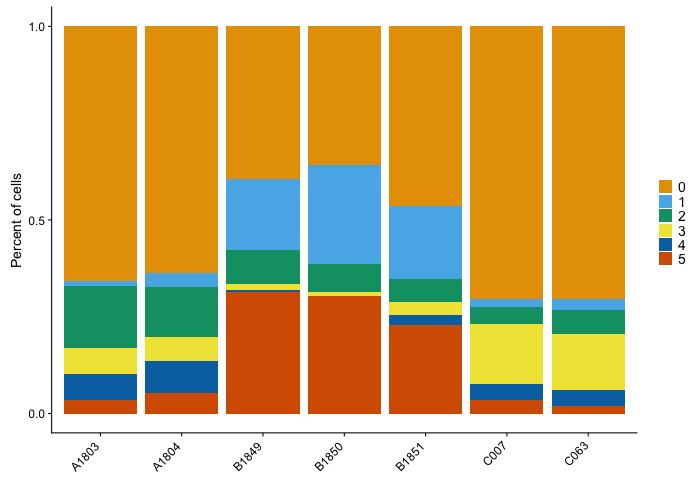
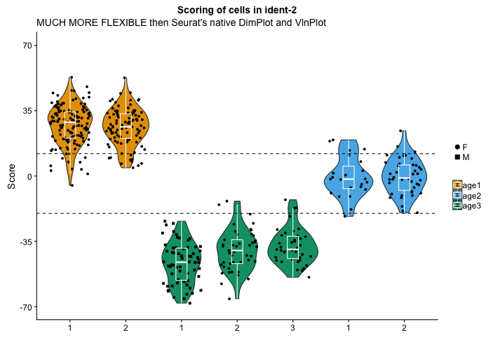
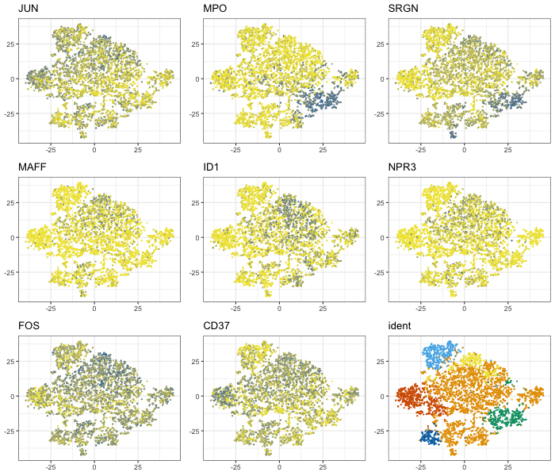

# RNAseqPlotR

This repository is being migrated due to a major upgrade: the code is jumping from Rscript to R-package!  I have renamed the package to DittoSeq and have transferred all content over to the [DittoSeq](https://github.com/dtm2451/DittoSeq) repository.  This repository only serves historical purposes now, and so will likely be deleted sometime in the near future.

**A set of functions built for analysis and color blind friendly visualization of single cell and bulk RNA-sequencing data**






*For a tutorial on how to use these functions, click [here](Vignette)*

Package includes various helper and plotting functions for working with RNAseq data analyzed in other packages; Seurat for single-cell RNAseq data, DESeq for bulk RNAseq data.

All plotting functions spit out default-themed plots upon minimal coding input for daily analysis needs, yet also allow various manipulations to provide for out-of-the-box submission-quality figures as well.  All plotting functions spit out a ggplot.

I built the functions while analyzing single cell RNAseq data with Seurat, but since then, I have started to add functionality for handling bulk RNAseq data as well.  Currently, the bulk capabilities only extend to DESeq-analyzed bulk data, but I plan to add functionality for edgeR and Limma/Voom in the near future.

NOTE: These functions are currently in a functional though not yet prime-time state.  They will eventually be released as a complete package withh all typical function documentation.  Currently, documentation is in the form of header comments in the actual [function code](RNAseqPlotR.R).  Hopefully, with those and with this tutorial, all the workings of these functions can be figured out!  If you have questions about how to do something, or would like to suggest new features, please message me!

## Color blindness friendliness:

The default colors of this package are meant to be color blind friendly.  To make it so, I used the suggested colors from this source: [Wong B, "Points of view: Color blindness." Nature Methods, 2011.](https://www.nature.com/articles/nmeth.1618)  Currently, when you source my package into your workspace, a variable called MYcolors is created that has the 8 colors refenced in the Points of View paper stored inside.  Lighter and darker versions of these same colors are then appended to make it a 24 color vector.  All plotting functions use these colors by default.  Also included is a Simulate() function that allows you to see what your function might look like to a colorblind individual (like me, this package's creator).  For more info on that, see my [Colorblindness Compatibility Page](ColorblindCompatibility)

## To use:

Save the code in RNAseqPlotR.R as an Rscript with the same name into your prefered directory.  Then, use this code to load the functions into your workspace:

```
source("LOCATION/RNAseqPlotR.R")
```

For a tutorial on how to use these functions, see [my Vignette](Vignette)

## Plotting Functions

**`DBDimPlot()`** = handles all needs for Seurat TSNEPlot / PCAPlot / DimPlot functions.  Improves on the Seurat functions' capabilities to present continuous (including negative) numerical data, or descrete data (clustering, samples, batches, condition, etc.) in various ways.

**`DBPlot()`** = handles needs of Seurat's VlnPlot function. Allows generation of jitter/dot-plot, boxplot, and/or violin-plot representation of numerical data, with order of what's on top easily settable. Data can be expression of particular genes or any numerical metadata like percent.mito, nUMI, and nGene.  Colors and grouping of cells is tunable through discrete inputs.

**`DBBarPlot()`** = No analogous function currently in Seurat, which is a bit crazy imho. Most common use: Plotting the cluster breakdown of all cells of each sample. Essentially, it is similar to DBPlot, but for discrete variables. Handles plotting of discrete data on a per-sample or per-condition grouping.

**`multi-plotters`** = Plot multiple DBDimPlots or DBPlots in an array.  Can handle most inputs that would be given to the individual functions.  Names are **`multiDBDimPlot()`**, **`multiDBPlot()`**, and **`multiDBDimPlot_vary_cells()`**.

## Helper functions

These make manipulating Seurat data, and using my plotting functons, easier.

**`get.metas()`** and **`get.genes()`**: Returns the list of meta.data slots or the list of genes included in the dataset.  Works exactly like typing `names(object@meta.data)` or `rownames(object@raw.data)`, only easier.

**`is.meta()`** and **`is.gene()`**: Returns TRUE or FALSE for whether a "meta.data" or "gene" input is part of the dataset.

**`meta()`** and **`gene()`**: Returns the values of a meta.data for every cell or the normalized expression data (`@data` slot) for all cells.

**`meta.levels()`**: Returns the range of values of metadata. Like running `levels(as.factor(object@meta.data$meta))`. Alternatively, can reurn the counts of each value of the meta.data if the optional input `table.out` is set to `TRUE`.

**`extDim()`**: extracts the loadings of each cell for a given dimensional reduction space.

**`rankedBarcodes()`**: Spits out a CellRanger-websummary-like plot of #UMI vs #cells.

## Color adjustment functions

**`Darken()`**: Darkens a color or color.panel by a given amount. (note: use these on a color.panel, not on a generated plot)

**`Lighten()`**: Lightens a color or color.panel by a given amount. (note: use these on a color.panel, not on a generated plot)

**`Simulate()`**: Generates any of the plot-types included in this package with colors adjusted to simulate any of the major forms of colorblindness.
